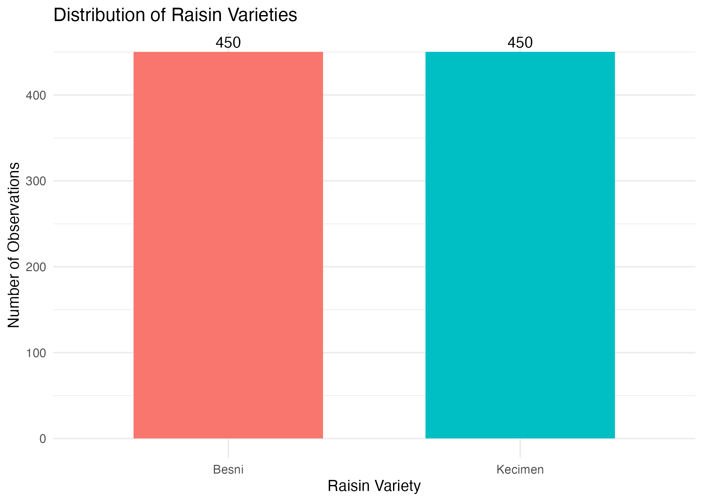
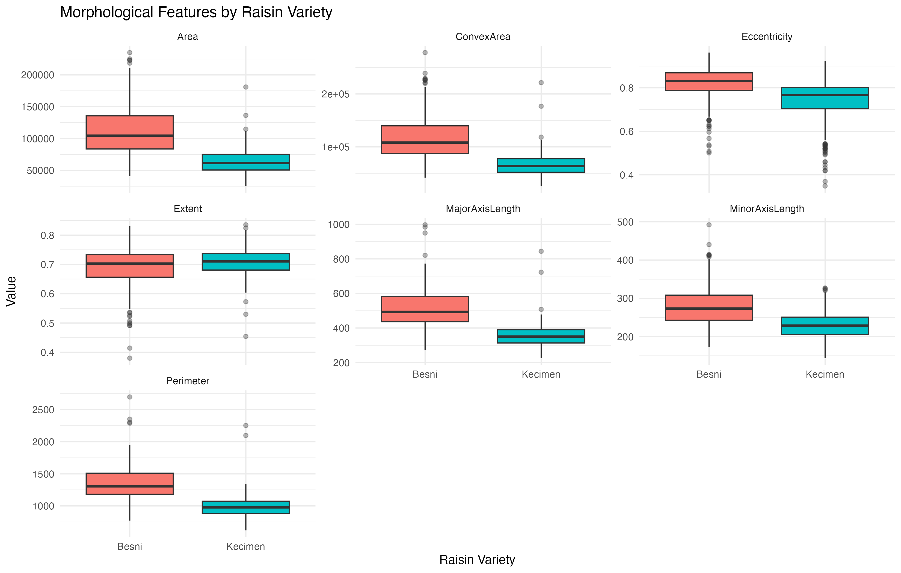
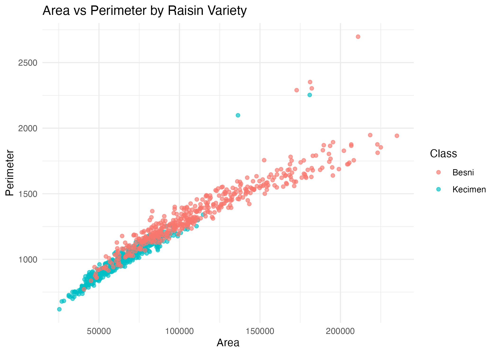
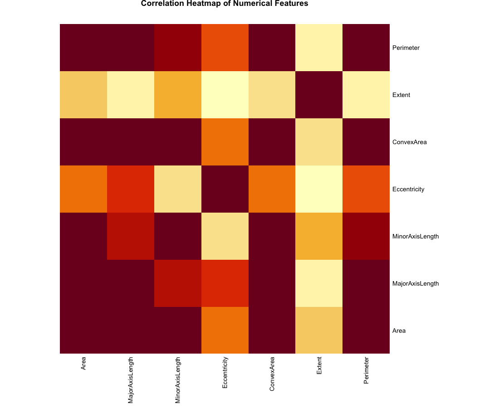
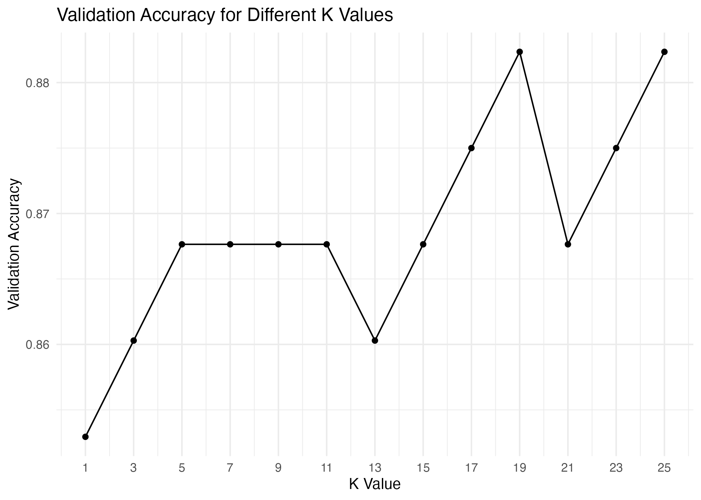

# Raisin Variety Classification with K-Nearest Neighbors


An end-to-end machine learning project that classifies **Besni** and **Kecimen** raisin varieties using their morphological characteristics. The project covers data quality checks, exploratory data analysis, feature scaling, model selection, and final test-set evaluation using the **K-Nearest Neighbors (KNN)** algorithm in R.

## Project Highlights

- Analyzed **900 raisin samples** with **7 numerical features**.
- Confirmed a balanced target distribution: **450 Besni** and **450 Kecimen** samples.
- Applied a stratified **70% training, 15% validation, and 15% test** split.
- Standardized numerical features before distance-based classification.
- Evaluated odd K values from **1 to 25** using the validation set.
- Selected **K = 19** as the final hyperparameter.
- Achieved **85.07% test accuracy** and an **84.38% F1 score**.

## Dataset

The dataset contains images of two raisin varieties that were processed to extract seven morphological features:

| Feature | Description |
|---|---|
| `Area` | Number of pixels within the raisin boundary |
| `MajorAxisLength` | Length of the longest axis |
| `MinorAxisLength` | Length of the shortest axis |
| `Eccentricity` | Measure of how elongated the raisin is |
| `ConvexArea` | Area of the smallest convex region containing the raisin |
| `Extent` | Ratio of raisin area to its bounding-box area |
| `Perimeter` | Length of the raisin boundary |
| `Class` | Raisin variety: `Besni` or `Kecimen` |

Source: [UCI Machine Learning Repository – Raisin Dataset](https://archive.ics.uci.edu/dataset/850/raisin)

## Workflow

1. **Data ingestion** – Load the included CSV file or download the original UCI dataset.
2. **Data quality checks** – Inspect missing values and remove duplicate observations.
3. **Exploratory analysis** – Examine class balance, distributions, boxplots, relationships, and correlations.
4. **Data splitting** – Create stratified training, validation, and test sets.
5. **Feature scaling** – Standardize predictors using statistics learned from the training data.
6. **Hyperparameter tuning** – Compare validation accuracy across different K values.
7. **Final evaluation** – Retrain with training and validation data, then evaluate on the untouched test set.

## Results

| Metric | Result |
|---|---:|
| Best K | **19** |
| Accuracy | **85.07%** |
| Precision | **88.52%** |
| Recall | **80.60%** |
| F1 Score | **84.38%** |

### Confusion Matrix

| Actual / Predicted | Besni | Kecimen |
|---|---:|---:|
| Besni | **54** | 13 |
| Kecimen | 7 | **60** |

The model correctly classified **114 of 134** test observations. Precision was higher than recall for the positive class (`Besni`), indicating that Besni predictions were generally reliable, although some Besni samples were classified as Kecimen.

## Visual Analysis

### Class Distribution



### Morphological Feature Distributions



### Area and Perimeter Relationship



### Correlation Heatmap



### K Selection



## Project Structure

```text
Raisin-KNN-Classification/
├── data/
│   └── raisin_dataset.csv
├── outputs/
│   ├── 01_missing_values_summary.csv
│   ├── 02_class_distribution.csv
│   ├── 03_class_distribution.png
│   ├── ...
│   └── 15_test_predictions.csv
├── .gitignore
├── Raisin_KNN_Project.R
└── README.md
```

## Technologies

- **R**
- **tidyverse** – data manipulation and visualization
- **readxl** – Excel data import
- **caTools** – stratified data splitting
- **class** – KNN classification
- **ggplot2** – visual analytics

## Running the Project

### 1. Clone the repository

```bash
git clone https://github.com/YOUR-USERNAME/Raisin-KNN-Classification.git
cd Raisin-KNN-Classification
```

### 2. Run the analysis

Open the project folder in RStudio and run:

```r
source("Raisin_KNN_Project.R")
```

The script automatically installs missing R packages and saves all generated tables and visualizations inside the `outputs/` folder.

## Key Learning Outcomes

This project demonstrates practical experience in:

- Preparing structured data for machine learning
- Conducting exploratory data analysis in R
- Preventing data leakage during feature scaling
- Using a validation set for hyperparameter selection
- Evaluating classification models with multiple performance metrics
- Organizing a reproducible data science repository for GitHub

## Possible Improvements

- Compare KNN with logistic regression, decision trees, random forest, and support vector machines.
- Use cross-validation instead of a single validation split.
- Investigate feature selection or dimensionality reduction with PCA.
- Add an interactive dashboard or lightweight prediction application.

---

This project was developed as an individual data science and machine learning study using R.
